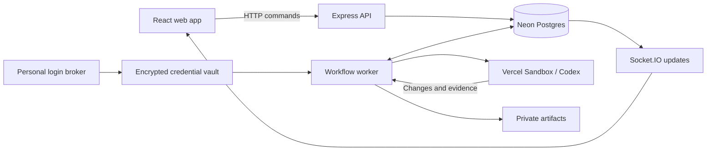

# Architecture

This describes the current implementation. [Status](STATUS.md) distinguishes live verification from local test coverage; [decisions](DECISIONS.md) records product constraints. Preview and GitHub publication services remain unfinished.

## Codebase

A Bun workspace monorepo with separate API and background processes. There is no Turborepo or distributed microservice framework.

| Location | Responsibility |
| --- | --- |
| `apps/web` | React/Vite board, conversations, account connections and review UI |
| `apps/api/src/routes` | Express endpoints that call checked domain services |
| `apps/api/src/auth` | Better Auth sign-in and session resolution |
| `apps/api/src/realtime` | Project-authorised Socket.IO subscriptions |
| `apps/api/src/processes` | API, brokers, workflow and publisher entry points |
| `packages/core` | Membership, claims, permissions, durable turns, jobs and approvals |
| `packages/database` | Prisma client, schema and SQL migrations |
| `packages/adapters` | Codex, Vercel and GitHub integration boundaries |
| `packages/contracts` | Shared types, validation and operation contracts |

`app.ts` composes middleware and routes; `server.ts` attaches Socket.IO. Neither starts a listener. Process entry points own startup. Tests and helper scripts stay local and are not included in the remote repository.

## Connections and shared state

Product identity, GitHub repository access and personal Codex access are separate. Board membership does not share an AI account. API requests and agent tools use the same project permission checks.

Prisma uses the pooled `DATABASE_URL`; migrations use `DIRECT_URL` when configured. There is no local database fallback. SQL migrations preserve constraints and triggers that are not replaceable with `prisma db push`.

HTTP commands persist state and event/job intent together. Socket.IO sends invalidations after committed events are observed; clients fetch authoritative snapshots. Thread refreshes coalesce bursts, preserve reader position and recover after reconnecting. Timed reads are a fallback for disconnection or failed requests. The current realtime server polls Postgres per subscription; shared event fan-out remains a scaling improvement.

## Threads and implementation ownership

A `ConversationThread` retains native Codex identity and private rollout state. An `AgentTurn` tracks one message’s execution, independently of task business state. A partial unique index prevents competing active turns in one thread. Ordered `AgentItem` records hold the visible timeline; `AgentRequest` records hold inline questions and decisions.

There is one native harness for conversation, planning and implementation. Project tools supply board context and bounded public repository reads. Ordinary messages create no task or implementation claim. The checked `start_task` operation requests human confirmation, validates task version, dependencies and limits, and acquires ownership before preparing a writable checkout.

Postgres enforces one active implementation claim per task and one active execution per claim. Browser closure and product review do not release claims. Task generations reject stale implementation results. Repository concurrency is a policy, independent of task identity.

## Warm sandbox lifecycle

`AgentRuntime` owns a Vercel allocation independently of turns. One live runtime per thread and a worker-owner lease govern reuse. Consecutive messages from the same actor and provider connection reuse the sandbox and native Codex process. The transport translates its cumulative event cursor into each turn’s sequence.

Idle runtimes expire after two minutes, within a fixed ten-minute total lifespan. They count toward concurrency limits. Account changes, archived threads and stale worker leases trigger retirement. No replacement starts until cloud stop is confirmed. Durable stop proof recovers a crash between sandbox retirement and turn completion. After expiry, a new sandbox restores the saved conversation; unsaved filesystem changes may be lost if a sandbox disappears before export.

Implementation handoff stops agent processes, exports an immutable candidate, stops processes left by checks, then seals the checkout and its parent read-only. A follow-up can restart Codex inside that sandbox. A later checked task grant verifies the retained candidate HEAD and clean worktree before restoring write access. Ownership remains with the task throughout review.

## Credentials and execution

The managed worker pins Codex 0.147.0 and uses an app-server bridge inside Vercel. The personal login broker uses a separate pinned binary and encrypted vault. The API receives neither the vault key nor the repository App secret.

Vercel’s network layer injects the real Codex credential only for approved backend requests. Sandbox files contain an inert placeholder. GitHub write credentials are absent. Repository setup, dependencies and checks run as the agent user inside the sandbox, never in the API process. Bun setup is version-pinned and integrity-checked.

Allocation and command intent are recorded before external operations. Unknown outcomes block unsafe replay. This provides reconciliation, not exactly-once execution across Postgres and external providers.

## Review, publication and completion

Private Git bundles and candidate manifests bind evidence to immutable changes. Successful checks do not verify every acceptance criterion, and provider completion does not complete a task.

The checked publication policy binds a designated human reviewer’s approval to the exact task, repository, base/head, artifact digest and requested action. Changed candidates require new approval. Merge requires separate authorisation and verified repository facts. Agents cannot approve either action.

The live publisher, required-check reconciliation and verified GitHub merge integration are unfinished. Existing policies and fixture tests are foundations, not proof of a working end-to-end publication flow. Authenticated previews must use a separate origin, scoped access and isolated browser state; that service is also unfinished.

See [setup](SETUP.md) for configuration and [harness research](HARNESS.md) for the pinned upstream references behind this design.
