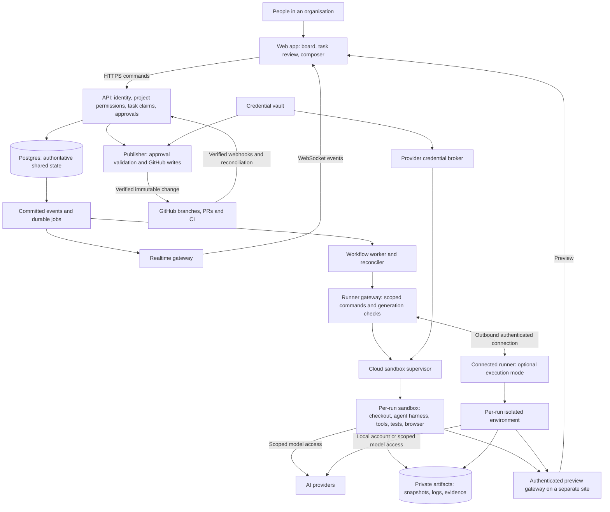
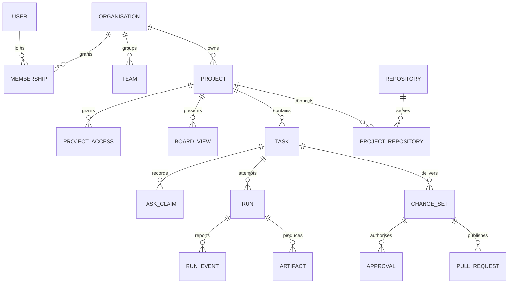
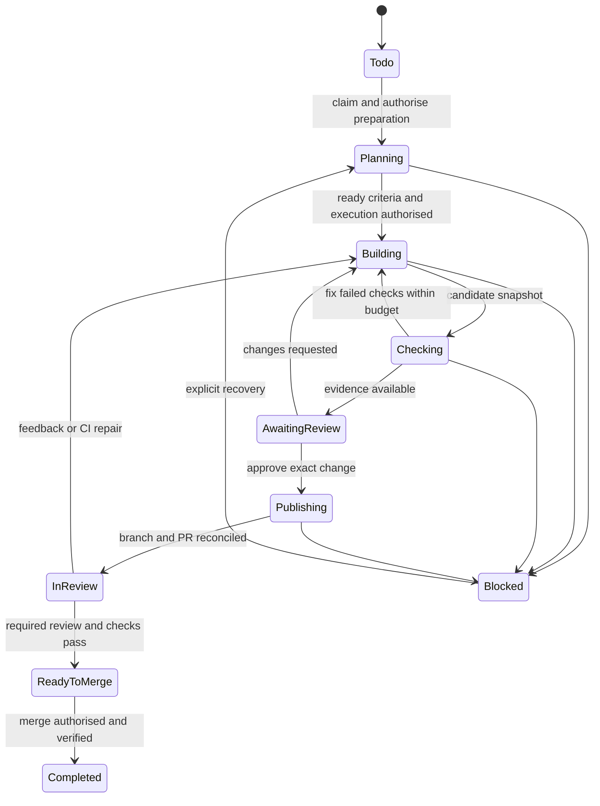

# System architecture proposal

Status: intended architecture. See [decisions](DECISIONS.md) for product constraints and [implementation status](STATUS.md) for what is built. Historical source-review notes are archived locally.

## 1. Product direction and feasibility

The six required capabilities are feasible together. The difficult work is reliable coordination, safe execution of arbitrary repository code, provider lifecycle integration, and making review understandable to a product manager. Treat these as foundational engineering work.

The product should centre on an outcome: a task explains the user problem, expected behaviour, acceptance criteria, and evidence of completion. Agent conversations, branches, tests, and pull requests belong underneath that task. Launch tasks target websites and web applications and complete only after an actual PR merge is verified. A future non-coding task type could have a separate reviewed-artifact rule. Running an agent successfully is not proof that the product outcome is complete.

Build a responsive website first. It supports invitations, shared links, central access control, and review across devices. The browser controls execution through a server; it cannot silently use a visitor's local CLI installation or credentials. A paired runner is required for that mode. A desktop wrapper can be added later without redesigning the core.

Use a Bun workspace monorepo and one TypeScript backend codebase with explicit domain modules, separately deployed API and background-worker processes, and isolated execution infrastructure. Do not start with a fleet of domain microservices. Process and security boundaries still matter even where code is shared.

## 2. System map



These are responsibility boundaries, not a demand for one deployment per box. The publisher must be isolated from untrusted execution and is the only component holding GitHub write access. The launch cloud runner uses a versioned protocol; connected-runner support is deferred.

The additions to the sketch are the workflow worker, durable job processing, execution infrastructure, credential boundary, publisher, private artifact storage, and preview gateway. WebSockets transport observations; Postgres decides who owns work.

## 3. Proposed stack and deployment

| Component              | Initial choice                                                   | Reason and boundary                                                                                       |
| ---------------------- | ---------------------------------------------------------------- | --------------------------------------------------------------------------------------------------------- |
| Website                | React, TypeScript, Vite                                          | A board-centric application with rich client interaction; no need to couple agent execution to rendering. |
| HTTP backend           | Express, TypeScript, schema validation                           | Fits the sketch. Keep routes thin and domain transactions explicit.                                       |
| Realtime               | Socket.IO over WebSockets; HTTP for durable commands             | Board updates, agent progress, presence; terminal transport later if needed.                              |
| Database               | Prisma ORM on Postgres; Neon selected for managed hosting        | Transactions, constraints, relational permissions, row security, durable jobs.                            |
| Workflow               | Persisted state machine and Postgres jobs/outbox                 | Restart recovery and retries without an additional queue service initially.                               |
| Execution              | Managed sandbox provider behind an adapter                       | Avoid building a VM fleet before proving the product. Vendor selection remains open.                      |
| Preview automation     | Playwright inside each execution environment                     | Browser checks, screenshots, traces, console/network evidence.                                            |
| Artifacts              | Private S3-compatible object storage                             | Large logs and snapshots should not inflate transactional tables.                                         |
| Repository integration | GitHub App plus verified webhooks                                | Selected repository access and server-side publication.                                                   |
| Initial agent          | Codex adapter; one additional provider after the workflow passes | A working provider seam is more useful than many superficial integrations.                                |

The API and worker require a hosting arrangement that supports their connection and lifetime needs. An ordinary short-lived HTTP function must not own an hours-long agent process. Keep API/worker and Postgres in one region initially. Set transaction-local tenant context on pooled connections; never rely on a session-level lock or tenant setting surviving a pool checkout.

Do not use Redis locks as the authority for task ownership. Redis can later help with ephemeral presence or multi-instance event fan-out. A workflow engine can later replace job scheduling if timers and compensation become unwieldy; task invariants remain in the domain database.

## 4. Identity, hierarchy and access



Use **Organisation → Project → Tasks** initially. A team grants membership or project access; a board is a saved view of tasks, so showing one task on two boards never creates two execution identities. Add portfolios or initiatives later as task/project groupings. In the UI, “workspace” means the shared organisation area. Internally call the disposable execution environment a sandbox to avoid confusing the two meanings.

| Entity              | Important data                                                                                                                               |
| ------------------- | -------------------------------------------------------------------------------------------------------------------------------------------- |
| Task                | Organisation/project, type, title, outcome, acceptance criteria, priority, lifecycle, version, accountable owner, dependencies.              |
| Task claim          | Task, claimant, responsible user, acquired/released times, ownership generation.                                                             |
| Run                 | Task/claim, provider connection, runner, execution generation, pinned base commit, environment/skill versions, lifecycle, budget, heartbeat. |
| Change set          | Task, immutable snapshot/hash, repo/branch, base and head commits, tests, preview evidence, publication state.                               |
| Approval            | Change set, exact action and payload hash, approver, role/policy version, expiration, revocation and consumption state.                      |
| Provider connection | Provider, auth mode, owning user/org, secret reference, allowed projects/users, health.                                                      |
| Repository          | Stable GitHub repository ID and installation link; project mappings must not duplicate coordination scope.                                   |
| Event/job           | Tenant, entity version/sequence, deduplication key, attempt count, lease, next attempt, persisted payload.                                   |

Each task has one accountable human owner and one active implementation claim. An agent acts on behalf of a named person or an explicitly authorised organisation automation identity. Provider credentials are separately scoped: sharing a board never silently shares someone's personal AI account.

Proposed roles are organisation owner/admin, project manager, contributor, reviewer, and viewer. A reviewer capability can be granted to a PM; technical GitHub checks can remain additional requirements. Organisation membership alone does not imply access to every private project. Review approval must check the current capability, project membership, repository policy, and provider delegation where relevant.

All tenant records and foreign keys preserve organisation scope. Use composite tenant-aware foreign keys where needed and row-level security as defence in depth. API, jobs, sockets, artifact downloads, previews, search, and runner commands each enforce the same permissions. Application DB roles must not bypass row security. [Postgres row-security reference](https://www.postgresql.org/docs/current/ddl-rowsecurity.html).

An organisation administrator explicitly maps installed repositories to projects. Project access can intentionally expose repository-derived previews or summaries to invited PMs without requiring each PM to have GitHub access; that sharing policy must be visible at setup. Never infer it from a GitHub login alone.

## 5. Three separate connection flows

1. **Product sign-in:** browser login establishes the person's identity and organisation membership. GitHub browser sign-in can be supported, alongside email or later SSO, so every PM does not need to learn `gh`.
2. **Repository connection:** an administrator installs the GitHub App for selected repositories and maps them to projects. Sign-in and installation are separate grants.
3. **AI connection:** the credential owner authorises a separately scoped provider connection; BYOK is a proposed default and paired local authentication is deferred. The UI identifies who can use it, which projects it covers, and who pays.

For Codex, the app-server protocol supplies a structured integration surface for threads, turns, streamed events and permission requests. Run it behind the runner adapter using its documented local transport; pin the CLI/protocol version. Codex supports subscription authentication and API-key authentication, but that does not make their billing or account permissions interchangeable. [Codex app server](https://learn.chatgpt.com/docs/app-server), [authentication](https://learn.chatgpt.com/docs/auth).

Managed cloud execution and Codex are confirmed for launch. Cloud BYOK is a proposed credential default only. A connected runner is a future extension for local accounts and private environments. Authenticate a local account through the provider-supported flow; do not upload someone's entire home directory or credential cache to the SaaS. Provider-specific support for hosted subscription sessions, delegated use, and organisation policies must be verified before offering those combinations. Do not promise that every provider accepts the same credential mode.

GitHub CLI is an optional tool inside a managed environment. It does not authenticate users to this product. Any `gh` available to an agent must have read-only or narrowly brokered capabilities; a pre-existing personal write token would defeat the publication guarantee.

## 6. Exclusive ownership and atomic claims

The invariant is **at most one active implementation owner per task**, enforced for people, agents, API clients, and future automations through the same command service.

Use a unique active claim constraint and a locked transaction for acquisition. The following is a schema illustration, not a migration:

```sql
CREATE UNIQUE INDEX one_active_claim_per_task
    ON task_claims (organisation_id, task_id)
    WHERE released_at IS NULL;
```

Inside one short Postgres transaction: authorise the actor; lock the task row; verify expected task version, eligibility, dependencies, and existing claim; insert the claim; update the task owner/lifecycle/version; write an audit event and durable job; commit. A competing request gets an explicit conflict response. The UI shows “Owned by Maya” and a handoff action; optimistic dragging must roll back when the command is rejected.

The agent may inspect the board to choose a useful candidate, but `claim_task` must succeed before allocating a coding environment or editing code. Batch picking uses queue-style locking such as `FOR UPDATE SKIP LOCKED`, bounded to authorised ready tasks, followed by invariant validation. Postgres documents this mechanism for queue-like consumers. [SELECT reference](https://www.postgresql.org/docs/current/sql-select.html).

Separate durable task ownership from the short runner execution lease. Human ownership does not expire when someone closes a tab. Waiting for review does not make the task available for another owner. A new run within the same claim still requires the previous execution to be settled.

Enforce one open execution per claim with a second database uniqueness constraint and a locked start transaction. The supervisor atomically accepts only one process launch for that run/generation. Different request IDs from the same owner must not create parallel implementations. Provisioning, disconnect recovery and cancellation count as open execution until settled.

Every run command/result carries a monotonically increasing execution generation. Database mutations, runner supervision and publication reject old generations. Heartbeats are server-timed. A local watchdog suspends execution when its lease cannot be renewed; the control plane also revokes capabilities.

**Lease expiry is not proof that an agent stopped.** Mark the run disconnected/recovering and keep the claim reserved. Before handing off or restarting execution, confirm process termination or isolate/destroy the old sandbox and revoke its external access. If that cannot be established, leave the task blocked for recovery. This deliberately prioritises exclusive execution over availability during a partition. Generation fencing rejects stale results but does not, by itself, stop CPU work.

Explicit handoff is: stop intake → cancel execution → confirm quiescence → save a recoverable snapshot → increment generation and transfer ownership → start the new owner. Comments and product feedback remain collaborative. Direct human editing of the sandbox requires a similar exclusive writer handoff.

Application-level transactions cover claims and accepted commands. They cannot make Postgres, a sandbox provider, and GitHub one atomic transaction. External operations use durable intent, retries, reconciliation, and compensating cleanup. Do not claim universal exactly-once execution.

## 7. Preventing interference across different tasks

Separate tasks can change the same code. Exclusive claims prevent duplicate task ownership; isolated environments prevent filesystem overwrites; neither guarantees that changes to different tasks will merge or behave correctly together.

Each run gets its own writable clone, branch, process group, test data, browser profile, and resource quota. Never mount a shared writable checkout or production database. Worktrees are useful on a trusted runner, but worktrees share Git metadata and are not a security boundary. Hosted untrusted execution should use a clone or snapshot with separate writable Git metadata.

Before starting, inspect task dependencies, explicit duplicate links, active claims, related open PRs, and a recent repository snapshot. Similarity-based duplicate suggestions are advisory; the system cannot perfectly recognise two differently worded tasks as the same work. Existing GitHub work should be linked or flagged for clarification rather than silently adopted.

Proposed pilot policy: one unresolved coding change set per repository across its projects, held through review until merge, rejection, or explicit abandonment. Other tasks may be planned and claimed while waiting for a repository slot. This conservative option reduces throughput but makes the first release easier to trust. Offer parallel changes later with visible overlap warnings, dependency ordering, and integration checks.

Use stable repository IDs for scheduling, not project-local repo aliases. For the pilot, one repository has one controlling organisation in the product. Cross-organisation links need an explicit coordination/sharing design before support.

When concurrency is enabled, track actual changed files and likely affected components. Never equate “different filenames” with semantic independence. Serialize merges per target branch, refresh target state, run checks on the proposed combined result, and require approval again if the reviewed change/base materially changes. External contributors can still push or merge outside this product; repository rules and CI remain necessary. The product can guarantee its own managed operations, not all activity in GitHub or an unmanaged laptop.

## 8. Durable workflow and truthful task status



This diagram is the coding path. Non-code completion rules are outside the launch slice. Rejected/cancelled work is recorded separately; it must not be presented as completed. Returning a coding task to Todo needs explicit release and a disposition for any existing change set or PR.

Persist task business state, run execution state, and external PR/CI facts separately. Derive progress badges from those facts. A provider turn ending means the model stopped responding; it must not automatically mean tests passed, changes were accepted, or a merge happened.

Each command carries an idempotency key plus a payload hash. Repeating the same accepted command returns the original result; reusing the key for a different payload fails. Commit task changes, job intent, and audit/outbox records together. Workers claim bounded jobs, keep network I/O out of database transactions, and reconcile ambiguous external results before retrying.

For sandbox provisioning, persist a stable run/provisioning key and query existing resources after a timeout. For PR creation, reconcile the exact repository/head/base identity before another attempt. A successful push followed by a failed PR request is a recoverable partial state, not a rolled-back push. Ownership remains held while publication is uncertain.

Persist ordered domain/run events; batch noisy token output separately. WebSocket messages include entity versions and resumable event cursors. On reconnect, replay retained events or fetch a fresh authoritative snapshot. Presence is ephemeral and never a lock. Subscription authorisation is checked per project and revoked when membership changes.

## 9. Approval and GitHub publication

“Never push without permission” is enforced by credential placement and a trusted publication boundary, backed by repository rules. Agent prompts and intercepted shell command strings are insufficient because a process could use another executable or GitHub's HTTP API.

| Operation                                                               | Proposed authorisation                                                          |
| ----------------------------------------------------------------------- | ------------------------------------------------------------------------------- |
| Read approved repo/task context                                         | Project membership plus connection scope.                                       |
| Start execution, install project dependencies, edit and test in sandbox | Explicit task execution grant; allowlisted environment/network/resource policy. |
| Create local branch/commit and preview                                  | Covered by the task execution grant.                                            |
| Push branch and open/update PR                                          | Human approval bound to exact change and described GitHub actions.              |
| Merge PR                                                                | Separate human authorisation plus required GitHub checks/reviews.               |
| Deploy to production                                                    | Separate release policy; out of initial product scope.                          |

The reviewer sees a product summary, acceptance results, preview, known limitations, and a diff disclosure before publication. A button can explicitly approve “Publish these changes and open a pull request” as one understandable bundle. It must disclose that repository workflows may run when the push/PR occurs.

Freeze the candidate before review. The approved manifest contains organisation/project/task, repository ID, destination ref, expected previous ref, pinned base/head commit, artifact digest, exact operation/PR payload, policy version, approver and expiry. Feedback creates a new candidate version. Never publish from a mutable live working directory.

The isolated publisher rechecks current membership/policy, claim generation, repository access, approval validity, and manifest hash. It imports the immutable change into a clean repository with hooks disabled, validates its identity, and uses compare-and-swap ref expectations where applicable. Ordinary pushes are fast-forward-only; force-push and target-branch changes need distinct policy and approval. Approval consumption and a durable publication operation are recorded before execution. Unknown outcomes are reconciled using that operation's identity; a retry is not a fresh blanket permission.

GitHub App tokens can be scoped by repository and permissions and expire after an hour. This scopes credentials but does not inherently restrict a token to one branch: the publisher enforces the approved destination, and repository rules protect target branches. Keep the app private key and all write tokens outside the sandbox. [Installation-token reference](https://docs.github.com/en/apps/creating-github-apps/authenticating-with-a-github-app/generating-an-installation-access-token-for-a-github-app).

Disable inherited provider connectors, user hooks and external tools that can publish through another credential or service. A connected runner must use a dedicated execution identity and an explicit environment allowlist. An unrestricted process in a person's normal logged-in shell cannot satisfy this hard publication boundary and must not be offered as an equivalent secure mode.

Repository workflows are external code execution too. Show workflow-file changes prominently; request the corresponding GitHub App permission only when supported. Do not silently grant the agent deployment secrets or permission to alter production environments. Pre-publication tests run in the sandbox; existing GitHub Actions run after the approved push/PR. CI repair creates another candidate requiring publication approval. [GitHub App permissions](https://docs.github.com/en/apps/creating-github-apps/registering-a-github-app/choosing-permissions-for-a-github-app).

Validate webhook signatures, persist/deduplicate deliveries, and acknowledge promptly before background processing. Refresh authoritative GitHub state when events arrive out of order or signals are missed. PR merge facts drive coding completion; deployment state remains a separate fact. [Webhook guidance](https://docs.github.com/en/webhooks/using-webhooks/best-practices-for-using-webhooks).

## 10. Sandboxes and browser preview

Prefer a managed isolation service with documented tenant boundaries for hosted arbitrary code. A container on the API host is not the proposed SaaS isolation model. MicroVMs are one feasible technology, but operating them ourselves is unnecessary for the first product. [Firecracker reference](https://github.com/firecracker-microvm/firecracker).

Sandbox configuration pins base image, architecture, setup command, run command, preview port, health check, required service fixtures, test commands, and allowed secret references. Detect these from the repository, then let the project maintainer confirm an environment template once. Unsupported stacks receive a clear setup-needed state; not every repository produces a browser preview.

The supervisor controls CPU/memory/disk limits, wall time, process cleanup, egress, checkpointing and expiry. Repository scripts execute only in the sandbox, with no host mounts, Docker socket, cloud metadata, production credentials, or other run's writable data. Dependency caches must not allow cross-tenant poisoning or private-source leakage. Initial environments should use project-local disposable test services and synthetic data.

AI/provider credentials deserve a separate isolation layer from repository shell commands. Use a trusted provider process and compatible credential proxy where possible; otherwise inject only a minimal per-run credential into a narrowly isolated process and document the remaining exposure. Never assume an environment variable is secret from arbitrary code running under the same identity. Adapters that cannot meet the chosen credential boundary must not be labelled fully isolated.

The preview has two distinct consumers:

- **The person:** an authenticated live view of the development server, normally embedded in the task drawer with an “Open preview” option.
- **The agent:** a Playwright-controlled browser with screenshots, DOM inspection, console/network logs and test actions inside the run's sandbox.

Playwright contexts isolate cookies/storage for tests; tenant security additionally requires execution isolation. Keep agent/test profiles separate from human reviewer sessions. [Playwright isolation](https://playwright.dev/docs/browser-contexts).

Route previews by immutable sandbox identity and allowed port through an authenticated gateway. Use a different registrable site from the product app, per-run origins, restrictive framing rules, isolated cookies, and short-lived grants. Do not forward product session cookies or credentials into the preview. Expire access when a run/project permission is revoked. Support WebSocket upgrades for development-server refresh.

Some app authentication flows cannot run correctly in an iframe. Provide an authenticated separate-tab preview first; remote-browser streaming is a later option. Human preview activity must not allow an agent to control the reviewer's personal browser or approve publication. Use synthetic/test accounts, and guard external browser actions through the tool policy.

Preview evidence shown for approval is tied to an immutable build/snapshot. A live development preview can change; label it separately so a reviewer knows which version they are approving. Suspend idle compute, preserve approved artifacts, and rebuild from snapshots when needed.

## 11. Harnesses, tools and skills

Keep these concepts separate:

- A **provider connection** chooses an account/model entitlement.
- A **harness adapter** controls an agent session and translates provider-specific lifecycle/protocol messages.
- A **tool** performs a checked operation such as reading a task or running a browser assertion.
- A **skill** provides reusable instructions and optional resources for a workflow.

The provider-neutral adapter contract covers capability discovery, auth health, start/resume, send input, interrupt/stop with acknowledgement, normalised events, permission requests, and usage reporting. Capability flags identify support for images, streaming, resumability, skills, MCP, cancellation, and approval callbacks. Keep raw provider events for diagnosis behind appropriate access and retention; do not invent capabilities for unsupported adapters.

A shared tool service backs the web API and agent tools. MCP is one transport for that tool service, not the owner of business permissions or task state. [MCP architecture](https://modelcontextprotocol.io/docs/2026-07-28/learn/architecture).

Initial tools: list/get tasks; read project context; suggest task splits; claim a task; report progress/blockers; read/search/edit the authorised checkout; execute bounded commands; run tests; inspect a preview; attach evidence; request review. Agent identity is injected by the trusted service, never accepted from an arbitrary `organisation_id` supplied by the model. All mutations use the same transaction and policy checks as human commands.

The planning agent can propose priorities and break outcomes into tasks. It cannot grant itself new access, publish code, or force another owner to release a task. Initial automation can choose ready tasks only within an explicitly authorised project, time/budget/concurrency envelope. “Look at my board” alone grants observation, not an indefinite execution schedule.

Skill registry records name, description, owner, version/content digest, origin, compatibility, required tools, and scope. Organisation/project admins enable reviewed versions. At run start, resolve a pinned skill set and mount or adapt it to the harness. Skill updates affect new runs; existing runs retain provenance. Load descriptions first, full instructions when selected, and resources only as needed.

Suggested skills: turn a request into acceptance criteria; prepare a product brief; implement a small change; verify a UI journey; prepare review evidence. Repository-provided instructions and downloaded skills are untrusted inputs. Skills never expand execution permissions, access other projects, auto-install privileged tools, or approve publication. Executable skill resources run under the same sandbox policy as repository code.

## 12. Frontend expansion of the supplied sketch

Preserve the simple visual structure: navigation menu at top left, project context, participant avatars at top right, three columns, and a broad composer anchored below the board. Keep high-contrast readable typography and modest card density; the user's latest direction is a soft light palette, rounded surfaces, Hugeicons, raised neumorphic action buttons and restrained motion. The root DESIGN.md records the current visual system.

| Area         | Behaviour                                                                                                                           |
| ------------ | ----------------------------------------------------------------------------------------------------------------------------------- |
| Navigation   | Organisation/project switcher, boards, review inbox, integrations and settings.                                                     |
| Todo         | Clear outcomes ready for planning or execution; missing criteria get a readiness badge.                                             |
| Ongoing      | One owner plus plain-language progress: Planning, Building, Checking, Needs your review, In code review, Blocked.                   |
| Completed    | Accepted result and date; coding tasks require verified merge under the initial policy.                                             |
| Card         | Outcome title, priority, owner, human/agent indicator, progress, dependency/blocker, latest meaningful update.                      |
| Participants | Presence and membership; never an indication that a task is claimable.                                                              |
| Composer     | Visible scope: project or selected task. A command preview explains which tasks will start/change when scope is broad.              |
| Task drawer  | Outcome and acceptance checklist, conversation, preview/evidence, review actions, activity; code/logs under an advanced disclosure. |

Preserve three columns by placing review and blocked badges inside Ongoing. Add a “Needs my attention” filter and review inbox immediately; a fourth Review column can be a later board preference. Status transitions remain domain commands even if users customise display columns.

Use product language in primary actions: “Start work”, “Try the preview”, “Request changes”, “Publish changes for code review”. Avoid using “Ship” for a push or PR because it can imply production deployment. Branch names, provider transcripts, token counts and terminal details are available when helpful, without dominating the PM workflow.

Comments and feedback are shared; feedback on an active task goes to its current owner. Starting a second agent from a task drawer must not bypass the claim. On mobile, show one column or a task list with the same ownership and review rules. Include keyboard-accessible card movement and meaningful screen-reader updates.

## 13. Delivery stages and acceptance gates

| Stage                           | Deliverable                                                                                                                                                  | Gate before moving on                                                                                                                 |
| ------------------------------- | ------------------------------------------------------------------------------------------------------------------------------------------------------------ | ------------------------------------------------------------------------------------------------------------------------------------- |
| 0 — Feasibility spike           | One chosen provider in one disposable sandbox, one repository template, private preview, immutable artifact, publisher path.                                 | Confirm auth/protocol support, cancellation, test execution, isolation boundaries and candidate publication on a dedicated test repo. |
| 1 — Collaborative foundation    | Login, organisations/projects/roles, shared tasks/comments, atomic claims, audit log, reconnecting board.                                                    | Concurrent claims and tenant-isolation tests pass; lost sockets cannot duplicate ownership.                                           |
| 2 — First complete product loop | Codex cloud execution with explicitly scoped credentials, pinned skills, tests/preview, reviewer inbox, approved branch/PR publication, verified completion. | Real task goes Todo → preview → feedback → approved PR → verified merge; crash recovery retains ownership.                            |
| 3 — Portability and hardening   | A second provider and paired runner, budgets, failure recovery, environment templates, operational dashboards.                                               | Both adapters satisfy the same lifecycle contract; disconnected runners cannot duplicate active execution.                            |
| 4 — Broader coordination        | Optional parallel repo changes, dependency planning, portfolios, richer skill catalogue, additional integrations.                                            | Integration checks, conflict reporting and cost controls remain understandable and reliable.                                          |

The launch scope is managed cloud execution with Codex, bounded explicit task/batch authorisation, reviewer-approved publication and separately authorised verified merge. Connected runners and additional providers are future work.

Important adversarial acceptance scenarios:

1. Many clients claim the same task at once: exactly one active claim and execution grant.
2. Two differently keyed requests try to start runs for that claim: one active execution generation.
3. A worker crashes after DB commit but before sandbox creation: retry reuses the same provisioning identity.
4. A runner loses network during a shell command: no replacement execution until the old environment is proven stopped/fenced.
5. A task is awaiting review for a day: it remains owned and no duplicate work begins.
6. A user loses access: old sockets, artifact links, previews and publication attempts stop authorising them.
7. An agent calls GitHub through curl or another client: no write credential or permitted write route exists.
8. Candidate code changes after approval: the publisher rejects the changed artifact.
9. GitHub accepts a push/PR and the response is lost: reconciliation recovers the operation without duplicating it.
10. Another contributor advances the target branch: merge checks refresh and invalid approvals are not reused.
11. Malicious repo scripts/skills/preview content attempt to access host credentials or another tenant: isolation blocks the access.
12. Two browser clients reconnect with different cursors: both converge on authoritative task state.

These are requirements for future implementation tests, not tests run during this design-only task.

## 14. Operations, costs and unresolved limits

Measure board command latency, claim conflicts, oldest queued job, sandbox startup time, stale heartbeats, preview readiness, publication failures, test pass/fail/unknown state, and provider usage. Correlate logs with organisation/task/run/operation IDs. Redact secrets; keep full transcripts private under project permissions and retention policy.

Set organisation and run budgets, maximum concurrent sandboxes, wall-time/tool-call caps, and bounded repair attempts. Report costs separately for model usage, execution minutes, storage, and egress. A CLI subscription does not remove sandbox costs. Usage reports can arrive late, so hard caps need resource/time enforcement and headroom rather than trusting a final token bill.

Back up Postgres, exercise restoration, retain immutable approved artifacts, and reconcile active claims/runs/publications on service startup. Use retention and garbage collection that checks active references before deleting a sandbox snapshot. An abandoned preview should stop consuming compute without discarding unreviewed work.

Open feasibility work: sandbox provider and residency choice; supported repository stacks and services; final hosted provider credential/billing arrangement; whether human editing is needed at launch; permission for delegated personal credentials; initial user/concurrency budget; and production hosting. Coding completion is confirmed as verified PR merge; deployment remains separate. No timeline or hosting-cost quote is justified before these are resolved and the Stage 0 spike is measured.

## API source layout

```text
apps/api/src/
  app.ts              Express middleware and route composition
  server.ts           HTTP server and Socket.IO attachment
  auth/               Better Auth identity and session resolution
  config/             Server options and allowed origins
  middleware/         Authentication, request policy and errors
  routes/             Account, workspace, task, team and connection endpoints
  realtime/           Authorized Socket.IO subscriptions and updates
  processes/          API, workflow, publisher, connection broker and fixture preview entry points
```

Routes translate HTTP requests into checked services in `packages/core`; database access, ownership and workflow policy remain there. `packages/adapters` owns external integration protocols. `app.ts` and `server.ts` create instances without starting listeners, while `processes/` owns startup. Better Auth mounts before JSON parsing, and protected routes mount after authentication. The preview entry point serves fixed local test content only.

Core modules share project access checks, lock ordering and event writes through `packages/core/src/project-context.ts`. They import the database package directly; shared policy does not depend on task commands or execution setup.
