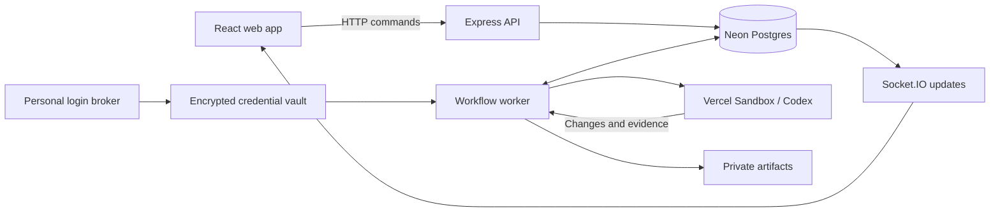

# Architecture

This describes the current implementation. [Status](STATUS.md) distinguishes live verification from local test coverage. Preview and GitHub publication services remain unfinished.

## Codebase

A Bun workspace monorepo with separate API and background processes. There is no Turborepo or distributed microservice framework.

| Location                 | Responsibility                                                     |
| ------------------------ | ------------------------------------------------------------------ |
| `apps/web`               | React/Vite board, conversations, account connections and review UI |
| `apps/api/src/routes`    | Express endpoints that call checked domain services                |
| `apps/api/src/auth`      | Better Auth sign-in and session resolution                         |
| `apps/api/src/realtime`  | Project-authorised Socket.IO subscriptions                         |
| `apps/api/src/processes` | API, brokers and managed worker entry points                       |
| `packages/core`          | Membership, claims, permissions, durable turns, jobs and approvals |
| `packages/database`      | Prisma client, schema and SQL migrations                           |
| `packages/adapters`      | Codex, Vercel and GitHub integration boundaries                    |
| `packages/contracts`     | Shared types, validation and operation contracts                   |

`app.ts` composes middleware and routes; `server.ts` attaches Socket.IO. Neither starts a listener. Process entry points own startup. Tests and helper scripts stay local and are not included in the remote repository.

## Connections and shared state

Product identity, GitHub repository access and personal Codex access are separate. Board membership does not share an AI account. API requests and agent tools use the same project permission checks.

Prisma uses the pooled `DATABASE_URL`; migrations use `DIRECT_URL` when configured. There is no local database fallback. SQL migrations preserve constraints and triggers that are not replaceable with `prisma db push`.

HTTP commands persist state and event/job intent together. One browser socket serves the selected project; the API shares an event poll across project subscribers and rechecks each session before notification. TanStack Query caches thread reads independently and coalesces targeted invalidations, with timed refreshes while disconnected. Timelines load 100 recent items, page older history by item sequence, and use committed event cursors to fetch changed items. A missed-event window or lifecycle change resets the recent page.

## Threads and implementation ownership

A `ConversationThread` retains native Codex identity and private rollout state. An `AgentTurn` tracks one message’s execution, independently of task business state. A partial unique index prevents competing active turns in one thread. Ordered `AgentItem` records hold the visible timeline; `AgentRequest` records hold inline questions and decisions.

There is one native harness for conversation, planning and implementation. Project tools supply board context and bounded public repository reads. Ordinary messages create no task or implementation claim. The checked `start_task` operation requests human confirmation, validates task version, dependencies and limits, and acquires ownership before preparing a writable checkout.

Postgres enforces one active implementation claim per task and one active execution per claim. Browser closure and product review do not release claims. Task generations reject stale implementation results. Repository concurrency is a policy, independent of task identity.

## Warm sandbox lifecycle

`AgentRuntime` owns a Vercel allocation independently of turns. One live runtime per thread and a worker-owner lease govern reuse. Consecutive messages from the same actor and provider connection reuse the sandbox and native Codex process. The transport translates its cumulative event cursor into each turn’s sequence.

Idle runtimes expire after two minutes, within a fixed ten-minute total lifespan. They count toward concurrency limits. Account changes, archived threads and stale worker leases trigger retirement. No replacement starts until cloud stop is confirmed. Durable stop proof recovers a crash between sandbox retirement and turn completion. After expiry, a new sandbox restores the saved conversation. New turns are refused near expiry, and active turns begin shutdown with 90 seconds reserved before the ten-minute hard limit.

Implementation work saves recovery Git bundles approximately every 30 seconds and before tool decisions. A separate Git index preserves the working tree and real index; unchanged trees reuse the last artifact. Files are flushed and atomically stored before the latest recovery manifest is persisted in a private `AgentItem`, fenced by runtime owner and task generation. Native conversation state is checkpointed alongside it. Shutdown saves again after stopping agent processes and before running checks.

If final export fails or a replacement worker completes retirement, the latest durable snapshot becomes a blocked candidate. Corrections restore that candidate and rerun checks; recovery never grants publication approval. Failed corrections retain the earlier candidate when no newer export exists. Abrupt loss can still discard changes since the last successful checkpoint, and concurrent file writes are not an atomic filesystem snapshot. Ignored files are not preserved. Local artifacts survive sandbox loss, but host loss and workers on separate machines require shared production storage.

Implementation handoff stops agent processes, exports an immutable candidate, stops processes left by checks, then seals the checkout read-only. Its root-owned sticky parent allows Codex sandbox metadata creation while preventing the agent from replacing the sealed repository. A follow-up can restart Codex inside that sandbox. A later checked task grant verifies the retained candidate HEAD and clean worktree before restoring write access. Ownership remains with the task throughout review.

## Credentials and execution

The managed worker pins Codex 0.147.0 and uses an app-server bridge inside Vercel. The personal login broker uses a separate pinned binary and encrypted vault. The API receives neither the vault key nor the repository App secret.

Vercel’s network layer injects the real Codex credential only for approved backend requests. Sandbox files contain an inert placeholder. GitHub write credentials are absent. Repository setup, dependencies, dev servers and checks run under an explicit unprivileged user inside the sandbox, never in the API process. Bun setup is version-pinned and integrity-checked.

Allocation and command intent are recorded before external operations. Unknown outcomes block unsafe replay. This provides reconciliation, not exactly-once execution across Postgres and external providers.

## Review, publication and completion

Private Git bundles and candidate manifests bind evidence to immutable changes. Thread recovery and candidate bundles contain changes relative to the pinned base commit; restoration fetches that base before applying the recorded candidate SHA. This avoids transferring unchanged repository assets on every export. Successful checks do not verify every acceptance criterion, and provider completion does not complete a task.

The checked publication policy binds a designated human reviewer’s approval to the exact task, repository, base/head, artifact digest and requested action. Changed candidates require new approval. Merge requires separate authorisation and verified repository facts. Agents cannot approve either action.

The live publisher, required-check reconciliation and verified GitHub merge integration are unfinished. Existing policies and fixture tests are foundations, not proof of a working end-to-end publication flow.

Live previews use a separate origin per runtime and session-bound, project-scoped access grants. A private gateway forwards HTTP and WebSockets through Vercel's authenticated connection without exposing the repository port. Coding handoff restarts the preview from a separate copy while the exported checkout remains sealed. Preview process records live outside the native bridge control directory, so restarting Codex does not orphan the retained dev server. Agent browser inspection uses a separate user and network namespace with a relay restricted to the preview port. Screenshots are immutable local artifacts served through project access checks. Hosted end-to-end verification and production artifact storage remain unfinished.

See [setup](SETUP.md) for configuration.

## Product constraints

The product serves teams and nontechnical founders building websites and web applications. Todo, Ongoing and Completed are the main board columns; review and blockers stay within Ongoing. Work is individual or an explicitly authorised, bounded batch. Agents never pick unrestricted autonomous work. Production deployment is outside the initial scope.

The pilot supports one configured project, public repositories and existing Vercel Hobby capacity, with no paid upgrade or API-key fallback. The worker processes up to two turns concurrently; database admission still enforces organisation limits and counts warm allocations. An inline question in one thread does not block another admitted thread. Repository concurrency (`repositories.max_changes`) is a separate configurable policy.

Additional providers and connected local runners are future extensions. Hosted credential renewal, entitlement, billing, production budget, scale, residency and broader repository-stack support remain open. [DESIGN.md](../DESIGN.md) defines the interface system.

Keep code minimal, readable and formatted with Prettier. Add comments only when needed. Commit under the repository owner's identity and push only with authorisation. Tests, helper scripts, credentials and scratch artifacts stay local. Preserve third-party license notices.
